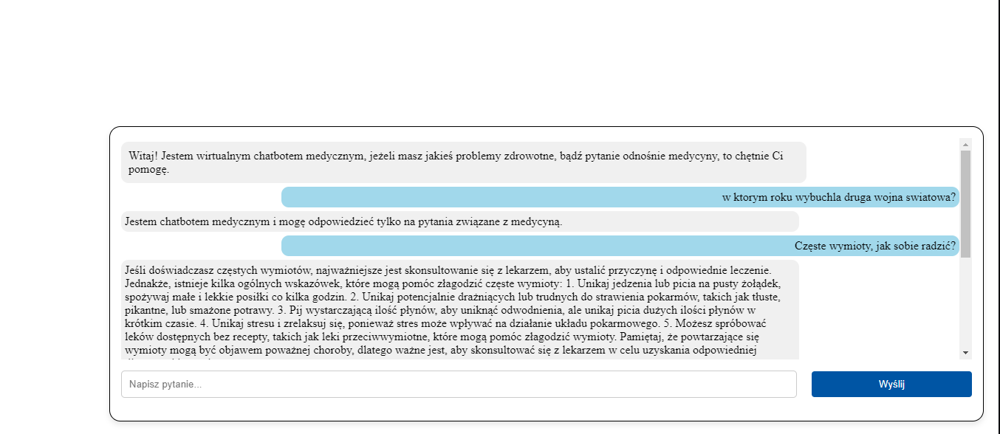

# 🩺 Medical Chatbot – AI-Powered Virtual Medical Assistant

This is a web-based chatbot application designed to provide general medical information. It uses the OpenAI API to generate responses to user questions. The chatbot is based on the GPT-3.5-turbo model and includes logic to filter out non-medical queries.

---

## 🧠 Project Features

- Interactive chatbot embedded in a web interface
- Filters out irrelevant or non-medical queries
- Provides structured responses to general health-related questions
- API key management via `.env` file
- Live chatbox interface with real-time conversation

---

## 🔧 Technologies & Libraries Used

- **Backend:** Python, Django, OpenAI API, spaCy, os, dotenv  
- **Frontend:** HTML, CSS, JavaScript

---
## 💬 Example Interaction
**User**: "How to deal with frequent vomiting?" 

**Bot**: (Provides a detailed answer based on general medical knowledge)

**User**: "When did World War II start?"

**Bot**: "I'm a medical chatbot and can only answer questions related to healthcare."


## 🚀 Installation & Usage

1. Clone the repository to your local environment
2. Create a `.env` file with the following content:

```env
OPENAI_KEY='your-api-key-here'
```
3. Start the Django development server:
```
python manage.py runserver
```
4. Open your browser and go to: http://localhost:8000

5. You should see a chat interface titled “WIRTUALNA POMOC MEDYCZNA ONLINE 24/7”. In the bottom-right corner, click the chat icon to start asking questions.
   

## 👥 Authors

This project was developed in collaboration with another team member as part of a university assignment.

- **Oscar Czempiel**  
  [LinkedIn](https://www.linkedin.com/in/oscar-czempiel/) | [GitHub](https://github.com/Cz-Oscar)
- [GitHub](https://github.com/Karol0114)

> The project was built jointly, and both contributors participated in the backend and frontend development, as well as OpenAI API integration.

This project is for educational purposes only. It should not be used to diagnose or treat real medical conditions. Always consult a healthcare professional.
